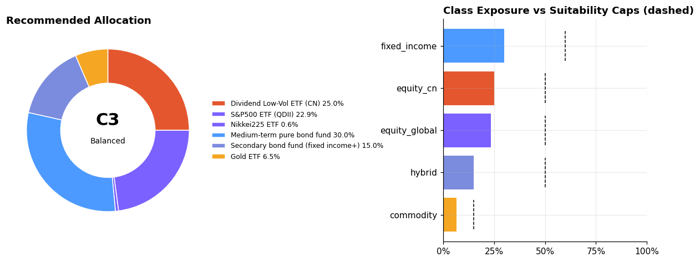

# Atlas · Multi-Asset Investment Advisor Agent

> A DeepSeek tool-calling agent for personal investing across **equities/funds,
> bonds, gold, crypto, and futures**. It profiles investor suitability (C1–C5)
> via **questionnaire + conversational inference**, allocates under **suitability
> constraints**, fuses **macro / geopolitical / factor intelligence**, and presents
> plans with honest, motivational charts.

> **Disclaimer**: This project is research/engineering material. Outputs do NOT
> constitute licensed investment advice. Markets carry risk; invest with care.

---

## 1. Strata-Aware Design

Professionalism starts with **client segmentation**: the same return target means
very different constraints at different capital scales.

| Segment | Investable Capital | Core Constraint | Allocation Framework | Product Access |
|---|---|---|---|---|
| Mass | < ¥200k | High cost of mistakes; tight liquidity | Index-DCA core + emergency fund first | Funds/ETFs/gold; **no futures** |
| Mass Affluent | ¥200k–1M | Wealth accumulation; mortgage coexists | Core–satellite–opportunity layers | + managed futures (capped) |
| HNW | > ¥1M | Cross-cycle preservation; tail risk | Institutional multi-asset + derivatives hedging | All asset classes |

Segmentation intersects with the **suitability tier** (C1 conservative → C5
aggressive, following CN investor-suitability convention). Every recommendation
must pass **both gates** (`config/risk_profiles.yaml`) — hard constraints at the
optimizer level, double-checked at the report level.

## 2. Architecture

```
                        ┌──────────────────────────────────────────┐
  Investor              │              InvestAgent                 │
  (Q&A)      ◄────────► │  DeepSeek harness (tool-calling loop)    │
                        │  llm.py + harness.py + tools/            │
                        └───────┬──────────────────────────────┬───┘
                    ask_investor │                              │ assess / build / charts / intel
                                ▼                              ▼
                        ┌────────────────┐        ┌────────────────────────┐
                        │ Risk Profile   │        │ Quant core (deterministic)
                        │ risk_profiler  │───────►│ personas: access gates │
                        │ survey+kw+LLM  │        │ advisor.build_plan()   │
                        └────────────────┘        │  ├ data (synth/akshare)│
                                                  │  ├ strategy.py ★       │
                                                  │  ├ shrinkage (L-W)     │
                                                  │  └ backtest/projection │
                                                  └────────────┬───────────┘
                        ┌────────────────┐                     ▼
                        │ Market Intel   │        report.py + charts.py
                        │ intel.py (news/│        (PNG / Markdown)
                        │ topic tagging) │
                        └────────────────┘
```

Key principle: **the quant core is fully deterministic** (plans work with no LLM —
easy to unit-test and generate training data). **The LLM is the conversational
interface**, driving the core through **18 tools**:

| Tool | Purpose |
|---|---|
| `ask_investor` | Ask the investor directly (pauses the loop for the answer) |
| `assess_risk_profile` | Survey answers / verbatim → suitability tier + class caps |
| `get_market_summary` | Historical performance summary of the asset pool |
| `list_strategies` | Strategy menu (philosophy / objective / cadence / tiers) |
| `build_investment_plan` | Auto-select or specify a strategy; produce the plan |
| `apply_timing_views` | Save subjective timing views (text or {class: tilt}); injected into the next plan |
| `get_market_intel` | Latest financial news/flashes, topic-tagged (crypto/US/bonds/commodities/macro) |
| `get_macro_advice` | Asset-class advice (over/neutral/under + style split; momentum/valuation/news/macro) |
| `get_global_situation` | Global political-economic situation (real-time news + risk appetite + themes) |
| `get_global_indices` | Real-time global index board (CN/APAC/Europe/Americas; dual-source + cache + fallback) |
| `get_asset_profile_questionnaire` | Asset-profile questionnaire structure (types / overseas % / accounts / liquidity) |
| `recommend_global_bases` | Family-office global basing (onshore/cross-border/offshore scoring + friction) |
| `get_final_advice` | Final integrated advice (quant × macro × geo × basing, organically fused + action list) |
| `get_analyst_council` | Analyst council: pick the 5 best-matched of ~30 legends and render their views |
| `evolve_factor_library` | Factor self-evolution (KB import + empirical IC learning + online collection) |
| `get_factor_knowledge` | Retrieve factor definitions / formulas / logic / direction from the factor library |
| `screen_assets_by_factors` | Score/rank the asset pool via the factor lens (momentum/reversal/low-vol/drawdown) |
| `generate_charts` | 4 charts: allocation donut, risk–return map, equity+drawdown, goal projection |
| `explain_product` | Product risk education (risk first, return second) |

### Requirement Understanding + Subjective Timing ★

- **Requirement understanding** (`requirement.py`): parses free text into a
  structured requirement `{risk tilt, timing views, asset interests, horizon}`,
  sentiment-aware ("crypto is crashing, sell everything" is NOT misread as high
  risk appetite). Benchmark: `training/eval/eval_requirement.py` (36 checks).
- **Subjective timing** (`timing.py`): bullish/bearish views act in two places —
  ① strategy-selection alignment ("bearish equities, seek safety" → rotates to a
  defensive strategy); ② tilt injected into expected returns before optimization.
  **Only affects the current allocation; historical backtests stay honest**; always
  bounded by suitability caps. Timing sliders live in the sidebar.

### Global Market Indices Board ★ (`global_indices.py`, always-on flagship)

A persistent top-of-page board of global indices (price / change / trading status):
**Mainland China** (SSE/SZSE/ChiNext/CSI300) · **APAC** (HSI/Nikkei/KOSPI/SENSEX/
STI/ASX200) · **Europe** (FTSE100/DAX/CAC40) · **Americas** (S&P500/Nasdaq/Dow/TSX).

**Dual-source reliability** (the flagship must stay lit):
- Primary **Tencent quotes** (very stable; CN/US/HK) + extended **eastmoney**
  (Japan/Europe/APAC; best-effort)
- Retry with backoff + 5-min TTL cache + graceful degradation (stale cache > empty);
  API flakiness never blanks the board
- Per-region **open/closed** status inferred from current UTC (approximate, DST ignored)

### Global Political-Economic Situation ★ (`geopolitics.py`)

A standalone, always-visible board: aggregates real-time news (eastmoney flashes /
CCTV / economic calendar), topic-tags it (geopolitical conflict / trade & tariffs /
central banks & rates / inflation & jobs / growth / capital-market policy), and emits
a **risk-appetite score, regime call (risk-on / neutral / risk-off), dominant themes,
and watch items**. Transparent, reproducible rules; graceful degradation on failure.

### Macro Asset-Class Advice ★ (`macro_advice.py`)

A class-level view layer on top of specific holdings, fusing four signals: real
momentum (trailing 12m per class), valuation percentile (tracking-index PE, 10y),
news sentiment (global risk appetite), macro read (China PMI). Outputs
**over/neutral/underweight + rationale** per class, plus **style/sector splits**
within equities (growth vs value, large vs small cap). Deterministic scoring; every
conclusion cites its driving signals.

### Family-Office Global Basing ★ (`global_base.py`)

A "friction-reduction" layer from a family-office perspective. A **base** = where an
investor domiciles/accesses global assets. Ships with a catalog of 12 global bases
(onshore: A-share account / onshore QDII funds / bank WM; cross-border: Stock Connect
/ Bond Connect / GBM Wealth Connect; offshore: HK brokerage / HK insurance / SG family
office / US brokerage / regulated crypto exchange / overseas real estate), each with a
**five-dimensional friction model** (capital control / tax / FX / access / compliance,
0–1) and thresholds.

Scored against **suitability tier + asset profile** (held asset types / overseas % /
overseas accounts / liquidity):
```
score = 100 · (capital_fit · asset_relevance · risk_fit · experience_fit) · (1 − λ·friction)
```
Outputs a ranked base list (score / friction / threshold / reasons), guiding
"low-friction onshore base → cross-border expansion → offshore only to fill gaps",
with compliant capital-outflow notes. Visualized in the "Global Basing" panel.

### Final Integrated Advice ★ (`final_advice.py`, organic fusion)

The layers above are **not independent** — a fusion layer threads them into one
recommendation spine:
```
quant allocation × class views × global situation × global basing
   └─ tilt class weights → suitability caps → redistribute within class → map each class to its best base
```
- **Geo-regime tilt**: risk-on → up risk classes / down defensive; risk-off → reverse + gold hedge.
- **Class-view tilt**: over ×1.22 / neutral ×1.0 / under ×0.68.
- **Basing map**: each asset class lands on the highest-scoring base that supports it.
- Output: final class allocation + global basing + thesis narrative + action list,
  auto-written into the report (`build_report(..., final_advice=...)`).

### Analyst Council ★ (`analysts.py`, ~30 legends → top-5 by direction)

A virtual panel of ~30 investment legends / schools (Jim Simons, Buffett, Munger,
Graham, Lynch, Soros, Dalio, Howard Marks, Templeton, Taleb, Swensen, Bogle,
Cathie Wood, O'Neil, Livermore, Asness, Thorp, ...). For each plan the council:

1. **Scores every analyst for directional match** against the current context
   (plan class weights, geo regime, strategy tags, suitability tier, crypto presence);
2. **Selects the top-5** most relevant lenses;
3. **Renders each persona's view** — a *personalized* stance derived from the
   analyst's own numeric posture (so contrarians genuinely dissent from momentum
   analysts even in the same regime), advice tied to the current allocation +
   macro view, class tilts, and their signature principle;
4. **Aggregates a consensus + dissent** and a one-paragraph summary;
5. **Weighted vote → net tilt**: each analyst casts a relevance-weighted numeric
   ballot per asset class; the aggregated net tilt (in [-1,1]) **feeds back into the
   final allocation** (`final_advice._apply_council_tilt`) as a bounded overlay —
   the council refines, it does not override the quant+macro+geo fusion;
6. **Divergence indicator** (`council_divergence`): `0.7·tilt-std + 0.3·stance-split`,
   scored 0–1 and leveled (高度共识 <0.20 / 中度分歧 <0.45 / 高度分歧). **The council's
   influence on the allocation is automatically damped by divergence**
   (`effective_strength = strength × (1 − divergence)`) and a caution is printed —
   a split panel should make you *less* confident, not more.
7. **Learnable voice weights** (`analyst_calibration.py`): each analyst's structural
   style tilt is backtested against forward asset-class returns on real data →
   style IC → `voice_multiplier = clip(1 + 5·IC, 0.5, 1.5)`. Vote weight =
   relevance × voice. Persisted in `data/analyst_weights.json` and **re-calibrated
   by the evolution daemon** — styles that keep working gain influence; styles
   that stop working get muted (e.g. measured: Bogle ×1.45, Cathie Wood ×0.87).

Example: a C5 crypto-heavy risk-on plan selects Wood / Andreessen / Simons / Asness /
Lynch; their weighted vote pushes equity+crypto up and bonds down, and the final
allocation reflects it (crypto capped at its suitability limit). A C1 bond-heavy
risk-off plan selects Klarman / Graham / Dalio / Druckenmiller / Fink. Output is clearly
attributed and labeled as reference views, written into the report's "Analyst Council".

### Factor Self-Evolution ★ (`factors/factor_store.py` + `factor_evolution.py`, autonomous)

A persistent in-project factor library (`data/factor_store.json`) that **grows on its
own, no manual trigger needed**:
1. **Knowledge-base import**: bulk-import the external factor library (1093 factors), keeping provenance.
2. **Broker-report collection (title-level)**: pull report titles, extract factor themes by concept keywords, register with provenance (report / institution / date).
3. **Report-PDF deep mining** (`report_pdf_miner.py`): scan the report API, locate
   factor-focused reports by keyword (factor / multi-factor / stock selection /
   financial engineering / alpha), download the PDF → extract full text → mine factor
   concepts (valuation / dividend / growth / momentum / low-vol / liquidity) and
   explicit "XX factor" definitions, registered with the report's own reasoning as evidence.
4. **Empirical learning**: derive factor signals from real data and measure **IC
   (information coefficient)**; more data → better estimates (e.g. short-term reversal IC≈0.48).

**Autonomous scheduling (learns even when you're not using Atlas)**:
- `make evolve-daemon`: background daemon, one learning cycle every 6h (`scripts/evolution_daemon.py`);
- **Startup catch-up**: on every page load, if >24h since last learning, auto-run a background cycle (`maybe_autolearn`);
- systemd: `deploy/atlas-evolution.service`; cron also works.
State logged in `data/evolution_state.json`; visible in the "Factor Self-Evolution" panel.

### Factor Library Fusion (1000+ quant factors) ★

`invest_agent/factors/` fuses the external factor library (`signal-name/data/json`:
1837 records / 1093 factors / 79 categories — momentum/reversal, volatility, liquidity,
valuation, fundamentals, behavioral finance, HF money-flow, etc.):

- **`loader.py` knowledge base**: parse → dedup → category index; mine return-direction
  priors ("positive/negative correlation") from rationale text; flag HF factors.
- **`lens.py` factor lens**: two-layer composite score; auto-downweights missing data, never fabricates:
  - *Return proxies* (computable for all assets): momentum(+) / short reversal(−) / low-vol(−) / drawdown-resistance(−)
  - *Live real factors* (`enrich.py` via free akshare, exchange ETFs only):
    **valuation** = tracking-index rolling-PE 10y percentile (−); **liquidity** = log turnover(+);
    **money-flow** = main net-inflow %(+); plus turnover/volume-ratio/premium/mcap fields.
  - Crypto / futures proxies / OTC funds lack exchange data → return proxies only, weights renormalized.
  - TTL cache (intraday 4h, valuation 24h); graceful fallback when APIs fail.
- **Three landing points**: ① satellite-sleeve coin selection blends the factor score;
  ② LLM tools retrieve factor knowledge to explain screening; ③ SFT samples inject
  factor-screening rationale so the fine-tuned model "speaks in factors".
- Config: `config/agent.yaml` → `factors.data_dir` (empty disables, graceful degrade).

### Strategy Layer (amplify strengths, don't pile assets) ★

Rather than cramming 26 assets into one portfolio, six philosophy-driven strategies, each with:

- **Screening**: class sleeve caps + asset-level tag exclusion (e.g. aggressive drops defensive/dividend; conservative drops high-beta/sector/meme)
- **Objective**: `max_sharpe` / `mean_variance` / `min_vol` / `risk_parity`
- **Cadence**: high (monthly) / mid (quarterly) / low (annual)

| Strategy | Philosophy | Objective | Cadence | Tiers |
|---|---|---|---|---|
| Steady Carry | Amplify fixed-income cash-flow certainty | min_vol | low | C1-C3 |
| Balanced Core | Max-Sharpe diversification across low-corr assets | max_sharpe | mid | C2-C4 |
| Global Equity Momentum | Amplify equity growth premium | max_sharpe | mid | C3-C5 |
| All-Weather Risk Parity | Equal risk contribution, no direction bets | risk_parity | low | C2-C5 |
| Aggressive Frontier | Amplify high-growth elasticity | mean_variance | high | C4-C5 |
| Crypto Barbell | Ultra-safe + high-elasticity extremes | mean_variance | high | C5 |

Profile→strategy auto-selection: `score = Sharpe − 1.5×vol-overrun − 1.2×return-shortfall`
(text signals add tier-gated boosts). The menu is backtested per-strategy on the same
data; the comparison table appears in the page/report.

## 3. Quickstart

```bash
pip install -r requirements.txt          # numpy/pandas/scipy/matplotlib/openai/pyyaml/akshare

make demo        # offline demo: mass / affluent / HNW → examples/demo_outputs/
make test        # unit + integration tests (108)
make eval        # compliance gate (weight legality / caps / disclaimer / segment access)
make sft         # generate 400 SFT conversations → training/sft_data/train.jsonl

# Interactive mode (needs DeepSeek key; else falls back to survey + offline pipeline)
export DEEPSEEK_API_KEY=***
make chat
```

Streamlit dashboard (optional): `pip install streamlit jinja2 && make dashboard`

### Sample output

```
[02_mass_affluent_C3] Mass Affluent · Balanced · family breadwinner, mortgage, beat inflation
   tier=C3 score=56 E[ret]=8.5% vol=10.6% Sharpe=0.61
   alloc: sp500_etf=39.2%, bond_fund=28.1%, csi300_etf=17.7%, gold_etf=15.0%
```


## 4. Quant Core

- **Expected returns**: sample means shrunk toward class priors (δ=0.6) to suppress
  mean-estimation noise (Black-Litterman spirit).
- **Covariance**: Ledoit & Wolf (2003) constant-correlation target with analytic
  oracle intensity (`cov_shrinkage`).
- **Optimization**: multi-objective — `mean_variance` (maximize `w'μ−(λ/2)w'Σw`),
  `max_sharpe` (direct, multi-start), `min_vol`, `risk_parity`. Unified constraints:
  **class caps (suitability ∩ strategy sleeve)**, single asset ≤65% (concentration
  discipline), no shorting. Falls back to risk parity on failure.
- **Strategy selection**: each menu strategy backtested at its own cadence; matched to
  the profile by `Sharpe − vol-overrun − return-shortfall`; overridable manually.
- **Backtest**: per-strategy rebalance (monthly/quarterly/annual), turnover × one-way
  fee; metrics = ann. return / vol / Sharpe / max drawdown / Calmar / turnover.
- **Intel**: `intel.py` pulls latest financial flashes, topic-tags them, caches 6h.
- **Data**: `SyntheticProvider` (fixed seed, bear/boom/crypto-crash regimes, offline
  reproducible); `AkshareProvider` + `MergedProvider` (real CN/overseas ETFs, funds,
  crude NAV; crypto & futures columns filled synthetically).

## 5. Local Training Loop

1. **Data**: `training/generate_sft_data.py` uses the deterministic pipeline as the
   "gold advisor" to synthesize multi-turn dialogues (system + question + answer +
   compliant plan) in OpenAI chat JSONL.
2. **Fine-tune**: fine-tune `deepseek-r1-distill` (e.g. 7B) with
   [LLaMA-Factory](https://github.com/hiyouga/LLaMA-Factory) / ms-swift; config in `config/agent.yaml`.
3. **Local inference**: serve via vLLM (OpenAI-compatible), set `provider: local` in
   `config/agent.yaml` — same harness, seamless switch.
4. **Evaluation**: `training/eval/eval_suite.py` is the hard-gate regression (weight
   legality, suitability caps, segment access, disclaimer) — run after every config/model
   change; `make test` covers quant-core numerics.

```
   ┌─────────────┐  generate  ┌──────────────┐  finetune  ┌──────────────────┐
   │ Deterministic│ ─────────►│ SFT JSONL    │ ─────────►│ local DeepSeek   │
   │ pipeline     │           │ 400+ dialogues│           │ distill (vLLM)   │
   │ (oracle)     │           └──────────────┘           └────────┬─────────┘
   └─────────────┘                                                 │
          ▲                                                        │
          └────────── eval_suite hard-gate regression ◄────────────┘
```

## 6. Layout

```
invest_agent/
  harness.py      # DeepSeek tool-calling loop (ask_investor pause)
  llm.py          # OpenAI-compatible client (official API / local vLLM)
  agent.py        # InvestAgent facade (chat + offline_plan)
  risk_profiler.py# 9-question survey + keyword inference + sentiment + LLM prompt
  personas.py     # client segmentation & access gates
  strategy.py     # ★ strategy layer: 6 strategies / screening / objective / cadence
  timing.py       # ★ subjective timing: text extraction / tilt injection / focus mode
  requirement.py  # ★ requirement understanding: risk+timing+interests+horizon
  geopolitics.py  # ★ global situation: real-time news + risk appetite + trend call
  macro_advice.py # ★ asset-class advice: momentum+valuation+news+macro
  global_base.py  # ★ family-office basing: 12-base catalog + friction model + scoring
  final_advice.py # ★ final integrated advice: quant × macro × geo × basing fusion
  analysts.py     # ★ analyst council: ~30 legends, top-5 by directional match
  analyst_calibration.py # ★ learnable voice weights (style IC -> multiplier)
  global_indices.py # ★ global index board: dual-source (Tencent+EM) + cache + fallback
  intel.py        # ★ market intel: news fetching + topic tagging + cache
  factors/        # ★ loader / lens / enrich(live factors) / factor_store /
                  #   factor_evolution / report_pdf_miner
  advisor.py      # strategy-driven allocation pipeline
  portfolio/      # metrics / optimizer(MV+maxSharpe+minVol+riskParity) /
                  #   backtest(walk-forward) / tactical(momentum+trend gate)
  data/           # base / synthetic / akshare / universe (26 assets)
  tools/          # 18 tools exposed to the LLM
  charts.py, report.py, cli.py
config/           # assets.yaml, risk_profiles.yaml, agent.yaml
scripts/run_demo.py         dashboard/app.py (streamlit)
training/         # README / generate_sft_data.py / build_real_dataset.py /
                  # eval/(compliance + requirement benchmark) / finetune/
examples/factor_library_sample/  # factor-library sample (full lib: factors.data_dir)
tests/            # 132 tests
.streamlit/config.toml + dashboard/style.py  # Jane Street-style light theme
```

## 6.5 Front-End Style (Jane Street)

Modeled on janestreet.com's **bright, minimal, academic** aesthetic: white background +
near-black text + signature red accent (`#d0001d`) + geometric sans-serif (Inter,
approximating Alright Sans) + uppercase letter-spaced section labels + thin rules +
hexagon motifs.
- `.streamlit/config.toml`: Streamlit light theme (white / red primary / near-black text)
- `dashboard/style.py`: injected CSS — metric cards, quote table, buttons, sidebar,
  dividers, top red rule, red hexagon section markers, thin scrollbars
- Header: black ATLAS + red hexagon SVG (the JS signature hex)
- Global index board is one dense quote table, green/red change coloring (pandas Styler, needs `jinja2>=3.1.2`)

## 7. Deployment: Expose the Dashboard

LAN access (simplest):

```bash
pip install streamlit "numpy<1.23"     # note: pin numpy<1.23 (old scipy incompatible with numpy2)
make dashboard-host                     # 0.0.0.0:8501, with token gate
# open  http://<server-ip>:8501
```

Recommended public setup (nginx reverse proxy + HTTPS + BasicAuth):

```
browser ──HTTPS(443)──► nginx (cert / auth / rate-limit) ──► 127.0.0.1:8501 (streamlit)
```

```nginx
server {
    listen 443 ssl;
    server_name atlas.example.com;
    # certbot-generated certs ...
    auth_basic "Atlas";  auth_basic_user_file /etc/nginx/.htpasswd;

    location / {
        proxy_pass http://127.0.0.1:8501;
        proxy_http_version 1.1;
        proxy_set_header Upgrade $http_upgrade;      # websocket, required by streamlit
        proxy_set_header Connection "upgrade";
        proxy_read_timeout 1800;
    }
    location ^~ /static/ { proxy_pass http://127.0.0.1:8501; }
    location /_stcore/stream { proxy_pass http://127.0.0.1:8501;
        proxy_http_version 1.1; proxy_set_header Upgrade $http_upgrade;
        proxy_set_header Connection "upgrade"; proxy_read_timeout 1800; }
    location /healthz { proxy_pass http://127.0.0.1:8501; }
}
```

No public IP / restrictive firewall? Use a tunnel: `frp` or `ngrok http 8501`.

Security checklist: ① enable `ATLAS_ACCESS_TOKEN` or nginx auth (Streamlit has none);
② expose only necessary ports; ③ never attach real trading credentials in a public
deployment — this project is read-only market data, keep it that way.

## 8. Roadmap

- [ ] Real crypto/futures data sources (ccxt / CTP quotes)
- [ ] Black-Litterman view injection (LLM report reading → view vector)
- [ ] Rebalance alerts & drift monitoring (scheduled jobs)
- [ ] Monte-Carlo stress tests & scenario charts
- [ ] Multilingual reports; mobile layout

## References

1. Markowitz, H. (1952). *Portfolio Selection*. Journal of Finance.
2. Ledoit, O., & Wolf, M. (2003). *Honey, I Shrunk the Sample Covariance Matrix*.
3. Maillard, S., Roncalli, T., & Teïletche, J. (2010). *The Properties of Equally Weighted Risk Contribution Portfolios*.
4. *Measures for the Administration of the Suitability of Securities and Futures Investors* (C1–C5 tiering convention).
