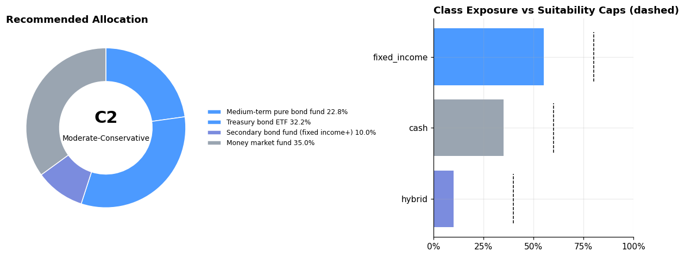
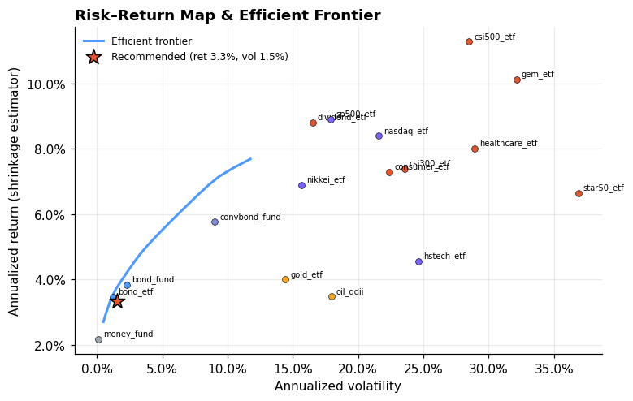
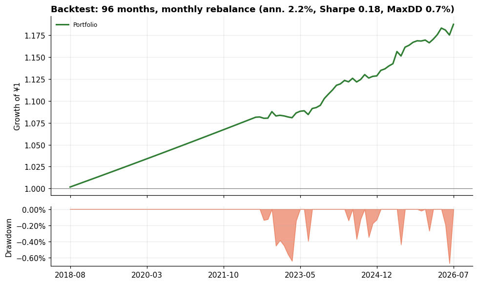
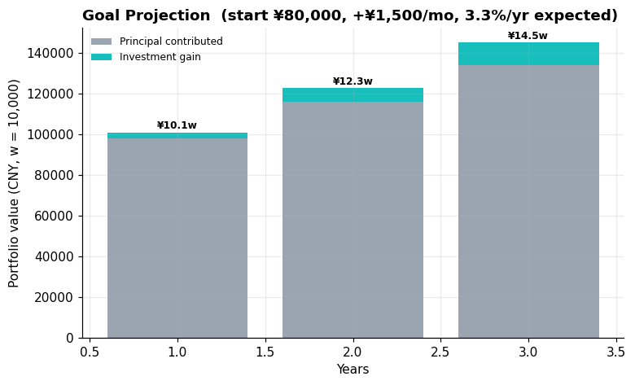

# Atlas 多元资产配置方案 | Multi-Asset Plan (C2 Moderate-Conservative)

客群分层: 大众客群（可投资本 ¥80,000）；适当性等级: 稳健型(评分28)。
客群观察: 本金规模有限，试错成本高；流动性约束强。
建议框架: 以指数基金定投构建核心仓位，保留3-6个月应急金，卫星仓位不超过10%，优先低费率工具。

## 0. 所选策略 Strategy

**稳健票息 (Steady Carry)** · 目标 `min_vol` · 调仓 `低频(年度)`

> 放大固收的确定性现金流，几乎不承担权益波动；用货基+纯债+短久期构建，目标是低回撤的稳定增值。

策略菜单对比（同数据、各自调仓频率回测）：

| 策略 | 目标 | 调仓 | 年化 | 波动 | 夏普 | 最大回撤 | 年化换手 |
|---|---|---|---|---|---|---|---|
| 稳健票息 ✅ | min_vol | 低频(年度) | 2.2% | 0.9% | 0.18 | 0.7% | 0.24 |
| 均衡核心 | max_sharpe | 中频(季度) | 5.5% | 6.8% | 0.51 | 8.1% | 0.35 |
| 全天候风险平价 | risk_parity | 低频(年度) | 5.1% | 7.0% | 0.45 | 7.0% | 0.37 |

## 1. 建议配置 Recommended Allocation

| 资产 Asset | 类别 Class | 权重 Weight | 预期年化 E[ret] | 年化波动 Vol |
|---|---|---|---|---|
| 货币基金/现金管理 Money market fund | cash | **35.0%** | 2.2% | 0.1% |
| 国债ETF Treasury bond ETF | fixed_income | **32.2%** | 3.5% | 1.2% |
| 中长期纯债基金 Medium-term pure bond fund | fixed_income | **22.8%** | 3.8% | 2.3% |
| 二级债基(固收+) Secondary bond fund (fixed income+) | hybrid | **10.0%** | 5.8% | 9.0% |

事前组合预期: 年化 **3.3%**, 波动 **1.5%**, 夏普≈ **0.85**

可投但本次未配置的资产（可及上限）: 沪深300ETF(equity_cn≤25%); 中证500ETF(equity_cn≤25%); 创业板ETF(equity_cn≤25%); 科创50ETF(equity_cn≤25%); 红利低波ETF(equity_cn≤25%); 医药ETF(equity_cn≤25%); 主要消费ETF(equity_cn≤25%); 标普500ETF(QDII)(equity_global≤25%); 纳指100ETF(QDII)(equity_global≤25%); 恒生科技ETF(equity_global≤25%); 日经225ETF(equity_global≤25%); 黄金ETF(commodity≤10%); 原油基金(QDII-LOF)(commodity≤10%)

## 2. 历史回测 Backtest（样本外走查·无未来函数，按策略调仓频率）

| 指标 Metric | 组合 Portfolio | 基准 CSI300ETF Benchmark |
|---|---|---|
| 年化收益 Ann. return | 2.2% | 4.6% |
| 年化波动 Ann. vol | 0.9% | 23.7% |
| 夏普比率 Sharpe | 0.18 | 0.11 |
| 最大回撤 Max DD | 0.7% | 60.7% |
| 卡玛比率 Calmar | 3.25 | 0.08 |
| 月度胜率 Win rate | 85.4% | 53.1% |
| 最差月份 Worst month | -0.5% | -16.5% |

## 3. 目标投射 Goal Projection

期初 ¥80,000，每月定投 ¥1,500，按预期年化 3.3% 估算：
> **3年后组合价值 ≈ ¥145,063**（其中收益 ¥11,063，投入本金 ¥134,000）

## 4. 图表 Charts

## 5. 纪律与再平衡 Discipline

- 每季度检查一次偏离度，类别权重偏离上限的 80% 时触发再平衡；
- 加密与期货仓位只使用闲余资金，禁止借贷加杠杆；
- 市场极端波动时优先降低单资产集中度，而非清仓离场。

---
> **免责声明**: 本系统输出仅为基于量化模型的研究性参考，不构成任何投资建议。 市场有风险，投资需谨慎。请结合自身情况咨询持牌投资顾问。 Outputs are research references only, NOT investment advice.
