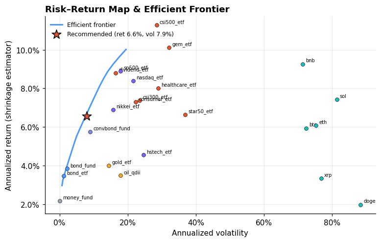
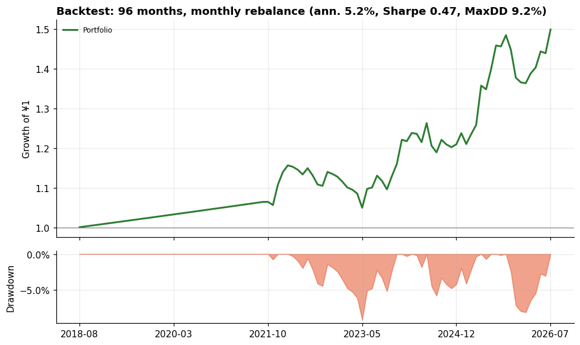
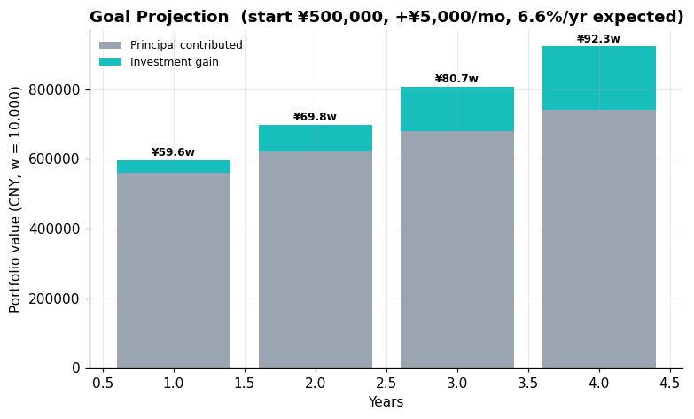

# Atlas 多元资产配置方案 | Multi-Asset Plan (C3 Balanced)

客群分层: 富裕客群（可投资本 ¥500,000）；适当性等级: 平衡型(评分56)。
客群观察: 处于财富积累期，收入上升但负债(房贷)并存，回撤容忍中等。
建议框架: 核心-卫星-机会三层：宽基核心+黄金/海外卫星+少量机会仓(加密/行业)，利用衍生品做保护而非投机。

## 0. 所选策略 Strategy

**均衡核心 (Balanced Core)** · 目标 `max_sharpe` · 调仓 `中频(季度)`

> 股债商均衡的核心仓位，用最大夏普在低相关资产间分散，牺牲少量收益换取显著更平滑的净值。

策略菜单对比（同数据、各自调仓频率回测）：

| 策略 | 目标 | 调仓 | 年化 | 波动 | 夏普 | 最大回撤 | 年化换手 |
|---|---|---|---|---|---|---|---|
| 稳健票息 | min_vol | 低频(年度) | 2.1% | 1.0% | 0.07 | 1.1% | 0.30 |
| 均衡核心 ✅ | max_sharpe | 中频(季度) | 5.2% | 6.7% | 0.47 | 9.2% | 0.35 |
| 全球权益动量 | max_sharpe | 中频(季度) | 7.9% | 16.0% | 0.37 | 21.6% | 1.88 |
| 全天候风险平价 | risk_parity | 低频(年度) | 5.0% | 6.9% | 0.44 | 6.9% | 0.37 |

## 1. 建议配置 Recommended Allocation

| 资产 Asset | 类别 Class | 权重 Weight | 预期年化 E[ret] | 年化波动 Vol |
|---|---|---|---|---|
| 中长期纯债基金 Medium-term pure bond fund | fixed_income | **30.0%** | 3.8% | 2.3% |
| 红利低波ETF Dividend Low-Vol ETF (CN) | equity_cn | **25.0%** | 8.8% | 16.5% |
| 标普500ETF(QDII) S&P500 ETF (QDII) | equity_global | **22.9%** | 8.9% | 17.9% |
| 二级债基(固收+) Secondary bond fund (fixed income+) | hybrid | **15.0%** | 5.8% | 9.0% |
| 黄金ETF Gold ETF | commodity | **6.5%** | 4.0% | 14.4% |
| 日经225ETF Nikkei225 ETF | equity_global | **0.6%** | 6.9% | 15.7% |

事前组合预期: 年化 **6.6%**, 波动 **7.9%**, 夏普≈ **0.58**

可投但本次未配置的资产（可及上限）: 沪深300ETF(equity_cn≤50%); 中证500ETF(equity_cn≤50%); 创业板ETF(equity_cn≤50%); 科创50ETF(equity_cn≤50%); 医药ETF(equity_cn≤50%); 主要消费ETF(equity_cn≤50%); 纳指100ETF(QDII)(equity_global≤50%); 恒生科技ETF(equity_global≤50%); 国债ETF(fixed_income≤60%); 货币基金/现金管理(cash≤40%); 原油基金(QDII-LOF)(commodity≤15%); 比特币(crypto≤5%); 以太坊(crypto≤5%); Solana(crypto≤5%); BNB(crypto≤5%); 瑞波币(crypto≤5%); 狗狗币(crypto≤5%)

## 2. 历史回测 Backtest（样本外走查·无未来函数，按策略调仓频率）

| 指标 Metric | 组合 Portfolio | 基准 CSI300ETF Benchmark |
|---|---|---|
| 年化收益 Ann. return | 5.2% | 4.6% |
| 年化波动 Ann. vol | 6.7% | 23.7% |
| 夏普比率 Sharpe | 0.47 | 0.11 |
| 最大回撤 Max DD | 9.2% | 60.7% |
| 卡玛比率 Calmar | 0.56 | 0.08 |
| 月度胜率 Win rate | 67.7% | 53.1% |
| 最差月份 Worst month | -4.9% | -16.5% |

## 3. 目标投射 Goal Projection

期初 ¥500,000，每月定投 ¥5,000，按预期年化 6.6% 估算：
> **4年后组合价值 ≈ ¥922,969**（其中收益 ¥182,969，投入本金 ¥740,000）

## 4. 图表 Charts

## 5. 纪律与再平衡 Discipline

- 每季度检查一次偏离度，类别权重偏离上限的 80% 时触发再平衡；
- 加密与期货仓位只使用闲余资金，禁止借贷加杠杆；
- 市场极端波动时优先降低单资产集中度，而非清仓离场。

---
> **免责声明**: 本系统输出仅为基于量化模型的研究性参考，不构成任何投资建议。 市场有风险，投资需谨慎。请结合自身情况咨询持牌投资顾问。 Outputs are research references only, NOT investment advice.
