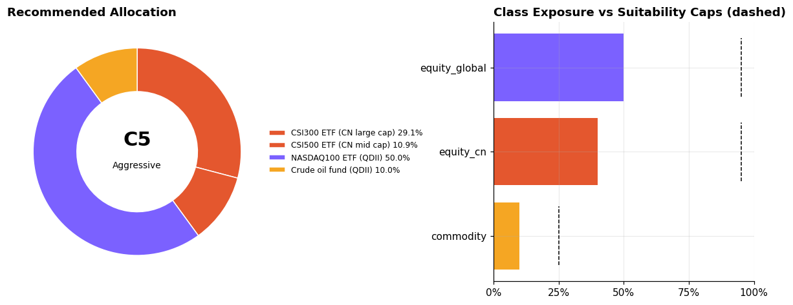
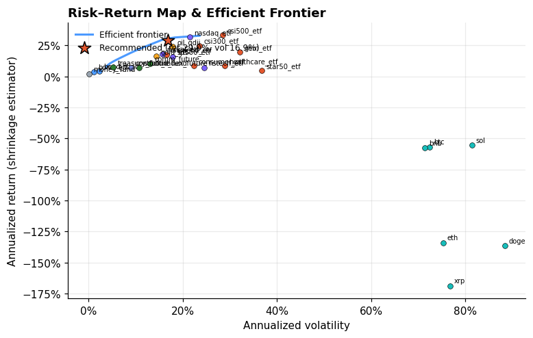
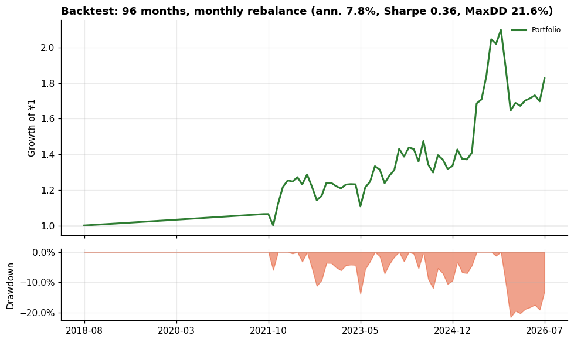
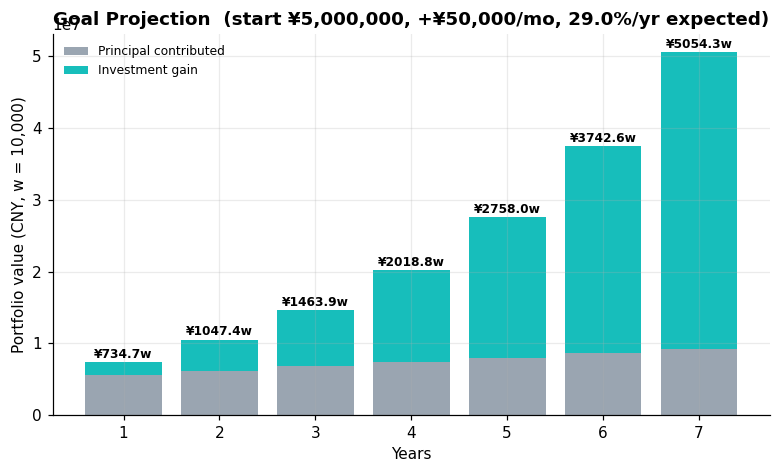

# Atlas 多元资产配置方案 | Multi-Asset Plan (C5 Aggressive)

客群分层: 高净值客群（可投资本 ¥5,000,000）；适当性等级: 激进型(评分100)。
客群观察: 目标是跨周期保值增值与传承；尾部风险与合规成本权重高。
建议框架: 机构化多资产配置：股债商加密+管理期货分散；控制单一资产敞口，考虑税务与代持结构。

## 0. 所选策略 Strategy

**全球权益动量 (Global Equity Momentum)** · 目标 `max_sharpe` · 调仓 `中频(季度)`

> 放大权益资产的长期增长溢价，集中在高夏普的宽基与科技指数，用季度调仓捕捉动量、控制换手。

策略菜单对比（同数据、各自调仓频率回测）：

| 策略 | 目标 | 调仓 | 年化 | 波动 | 夏普 | 最大回撤 | 年化换手 |
|---|---|---|---|---|---|---|---|
| 全球权益动量 ✅ | max_sharpe | 中频(季度) | 7.8% | 16.0% | 0.36 | 21.6% | 1.86 |
| 全天候风险平价 | risk_parity | 低频(年度) | 4.9% | 7.3% | 0.40 | 8.8% | 0.38 |
| 进取前沿 | mean_variance | 高频(月度) | 3.9% | 20.6% | 0.09 | 33.2% | 4.49 |
| 加密哑铃 | mean_variance | 高频(月度) | 2.8% | 13.1% | 0.06 | 26.1% | 0.87 |

## 1. 建议配置 Recommended Allocation

| 资产 Asset | 类别 Class | 权重 Weight | 预期年化 E[ret] | 年化波动 Vol |
|---|---|---|---|---|
| 纳指100ETF(QDII) NASDAQ100 ETF (QDII) | equity_global | **50.0%** | 31.7% | 21.6% |
| 沪深300ETF CSI300 ETF (CN large cap) | equity_cn | **29.1%** | 24.7% | 23.5% |
| 中证500ETF CSI500 ETF (CN mid cap) | equity_cn | **10.9%** | 33.2% | 28.5% |
| 原油基金(QDII-LOF) Crude oil fund (QDII) | commodity | **10.0%** | 23.9% | 17.9% |

事前组合预期: 年化 **29.0%**, 波动 **16.9%**, 夏普≈ **1.60**

可投但本次未配置的资产（可及上限）: 创业板ETF(equity_cn≤95%); 科创50ETF(equity_cn≤95%); 红利低波ETF(equity_cn≤95%); 医药ETF(equity_cn≤95%); 主要消费ETF(equity_cn≤95%); 标普500ETF(QDII)(equity_global≤95%); 恒生科技ETF(equity_global≤95%); 日经225ETF(equity_global≤95%); 中长期纯债基金(fixed_income≤30%); 国债ETF(fixed_income≤30%); 二级债基(固收+)(hybrid≤70%); 货币基金/现金管理(cash≤15%); 黄金ETF(commodity≤25%); 比特币(crypto≤20%); 以太坊(crypto≤20%); Solana(crypto≤20%); BNB(crypto≤20%); 瑞波币(crypto≤20%); 狗狗币(crypto≤20%); 商品期货(CTA策略代理)(futures≤15%); 股指期货(对冲策略代理)(futures≤15%); 国债期货(久期管理代理)(futures≤15%)

## 2. 历史回测 Backtest（样本外走查·无未来函数，按策略调仓频率）

| 指标 Metric | 组合 Portfolio | 基准 CSI300ETF Benchmark |
|---|---|---|
| 年化收益 Ann. return | 7.8% | 4.6% |
| 年化波动 Ann. vol | 16.0% | 23.7% |
| 夏普比率 Sharpe | 0.36 | 0.11 |
| 最大回撤 Max DD | 21.6% | 60.7% |
| 卡玛比率 Calmar | 0.36 | 0.08 |
| 月度胜率 Win rate | 72.9% | 53.1% |
| 最差月份 Worst month | -12.6% | -16.5% |

## 3. 目标投射 Goal Projection

期初 ¥5,000,000，每月定投 ¥50,000，按预期年化 29.0% 估算：
> **7年后组合价值 ≈ ¥50,543,415**（其中收益 ¥41,343,415，投入本金 ¥9,200,000）

## 4. 图表 Charts

## 5. 纪律与再平衡 Discipline

- 每季度检查一次偏离度，类别权重偏离上限的 80% 时触发再平衡；
- 加密与期货仓位只使用闲余资金，禁止借贷加杠杆；
- 市场极端波动时优先降低单资产集中度，而非清仓离场。

---
> **免责声明**: 本系统输出仅为基于量化模型的研究性参考，不构成任何投资建议。 市场有风险，投资需谨慎。请结合自身情况咨询持牌投资顾问。 Outputs are research references only, NOT investment advice.
